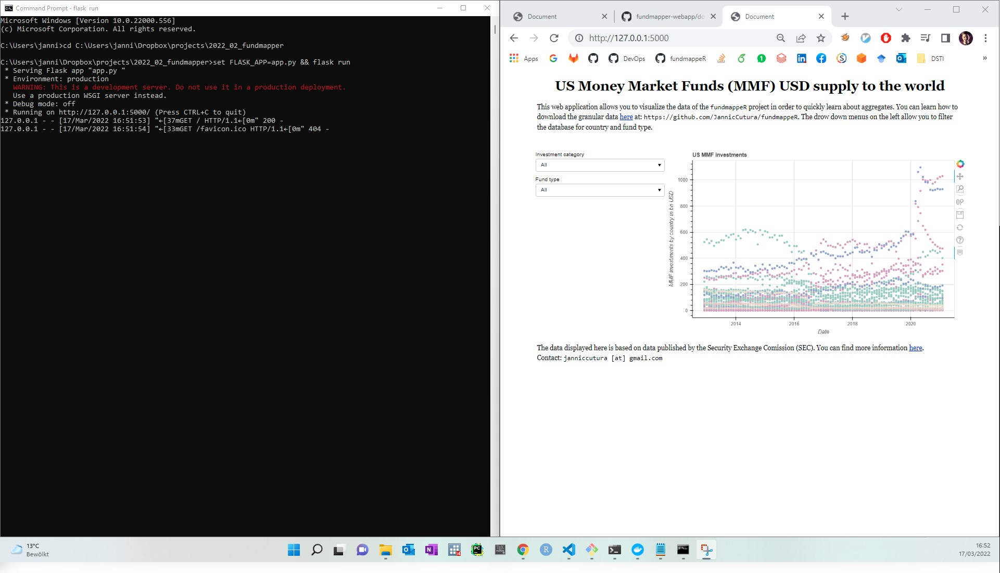
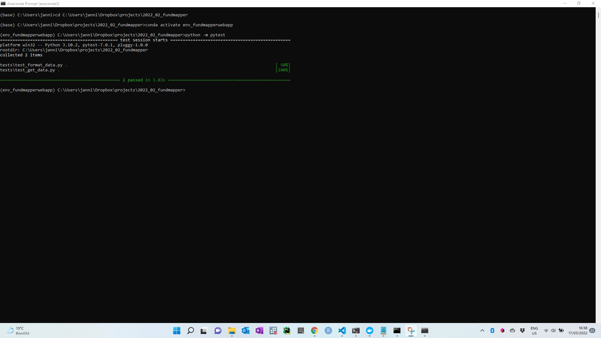
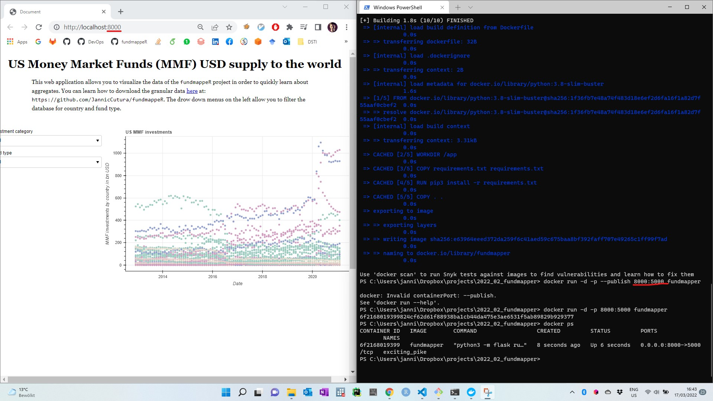
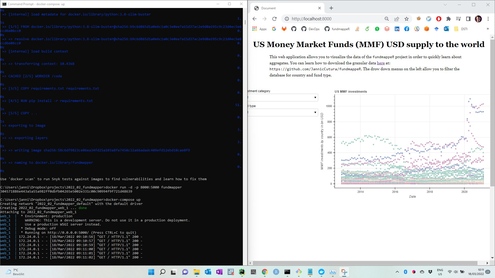

# Documentation
Below listed all the devops technologies tested. 

## Local Development
To develop locally on Windows work on the code. To test open command prompt `cd` to the folder and run:

`set FLASK_APP=app.py && flask run`

To run unit tests locally, `cd` to the folder and activate the anaconda distribution (`conda activate <env_name>`):
`python -m pytest`

## Github Actions
I am using `pytest` and Github Actions (see also the workflow file `fundmapper-webapp/.github/workflows/python-app2.yml`). Tests execute fine and are set to 
be run on every push to `main` or pull request to `main`.

This is really useful! When I updated `numpy` to avoid, the tests failed showing me that I need a different version of `pandas` now as well:

## Docker
To create the docker image:

`docker build --tag fundmapper .`

To run it:

`docker run -d -p 8000:5000 fundmapper` 

You can download the image [here](https://hub.docker.com/repository/docker/cuturaj/fundmapper). 

Next, I created a docker compose file. A bit of an overkill since I am using only one service, but stil good to see that it works. Also make it easier to not
have to specify the ports manually as above. Run:

`docker-compose up`

## Kubernetes
Kubernetes resources are stored in `kubernetes/`. To run and test locally, first start minikube: 

`minikube start`

Next, launch the app:

`kubectl expose deployments/flask --type="NodePort" --port 8000`

The app can be viewed here: 

`minikube service flask`

## Deployment / Serving on AWS
