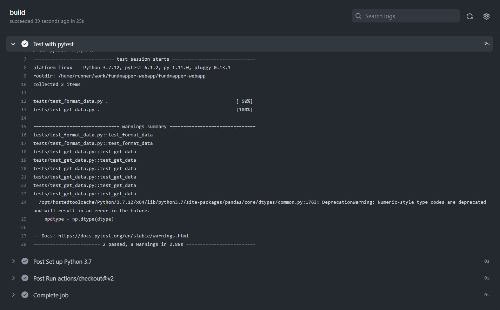
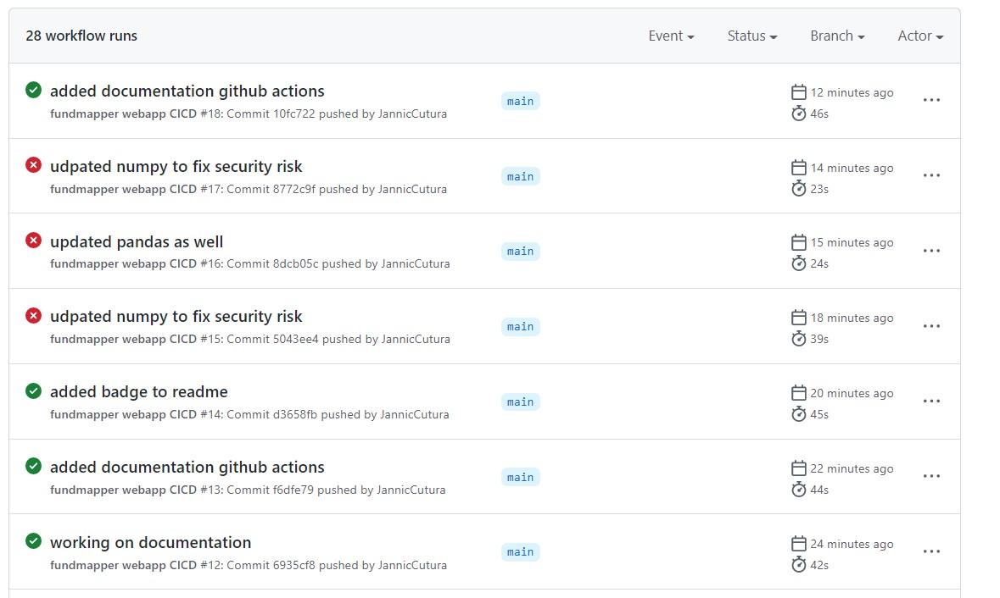

# Documentation
Below listed all the devops technologies tested. 

## Github Actions
I am using `pytest` and Github Actions (see also the workflow file `fundmapper-webapp/.github/workflows/python-app2.yml`). Tests execute fine and are set to 
be run on every push to `main` or pull request to `main`.

This is really useful! When I updated `numpy` to avoid, the tests failed showing me that I need a different version of `pandas` now as well:

## Docker

## Kubernetes

## Deployment / Serving on AWS
